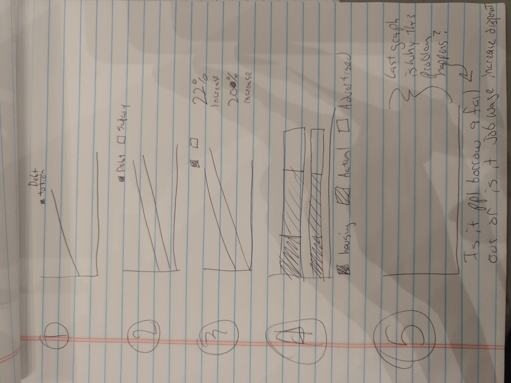

# Final_Project_ewalters

https://elliottwalters.github.io/Final_Project_ewalters/

NEW OUTLINE:

Thesis: Student Loan Crisis is much different than we think.

1: university prices rises: A bunch

2: debt has increased but not at the same pace

3: salaries have almost kept pace with held debt

4: 22% to 20% which match inflation of 2% over 10 years

5: Why? many people get price breaks to go to uni.

6: so why the issue? God I hope I find out in the next 5 days or this is a waste of time.

The original outline did not end upmatching the actual data I found or at least the part that was the most interesting. Instead I pivoted topics to start to cover the actual numbers behind student loans

OLD STUFF STARTS HERE

I. Thesis: University's have been on an unsustainable upward growth. 

1. Tuition growth (data set 1.)

a. Doesnt match inflation (data set 2)

2. Student loan repayment times(data set 3)

a. holding back a generation

b. ignore supply and demand/ prisoners dillema

3. Universities need to level off their tuition and develop more pipelines into buisnesses in new developing areas.

a. ethical behvior missions statement)

OLD STUFF ENDS HERE

The information for the first chart is going to come from these two graphs. The first one is a very quick and easy data source that looks at the average costs of college tuition prices. Right now I am on the fence about using total costs or just tuition. I thnk total costs will be more stark but it might be unrealistic because some of the housing costs may be smaller for some students by living at home or staying in lower cost housing off campus. 

I am than going to add the itial costs and adjust those for inflation based on a government sourced inflation calculator to see how tuition has been outpaced by rising costs. Right now this is a major issue for many universities as they have expanded to accommodate a rising number of students to continue to grow but there are only so many new students that can be added.

Data set 1 retrieved from : https://trends.collegeboard.org/college-pricing/figures-tables/tuition-fees-room-and-board-over-time

Data set 2 calculate inflation here: https://www.bls.gov/data/inflation_calculator.htm might need some trial and error. biggest jumps start at 2008

The project itself will probably be made using Shorthand as that is the suggested method. That said the exact method I plan on using Shirthand for is still being decided. I found the site itself to be easy to use but the amount of tutorials I have been sitting through to be overwhelming. 

Wireframe on paper image.

Rough Drafts for first chart:

https://infogram.com/app/#/edit/66ef6dda-0933-4119-ae7d-c9b0dad87277

A quick walkthrough of what this is. 

1st chart is going to be students loan debt average per person in the USA. Suprising!

2nd slide is the average salary in the use for people with a BA. Its alsomst the same growth. What? Why are we in a student loan crisis?

3Rd chart: add some number so people know what they are seeing. Gotta make it clear for them.

4th chart: show why this is. The amount of tutition advertised does not match what is paid in most cases. in most cases people are cut a break so that while tuition has gone up debt has not. This is why you are seeing what is in the first slide.

5th slide: This is where I figure out where the problem is. I think a big issue is that people take out loans and do not graduate but I need to look at more information.

The first four charts are my hand written scribbles of how the data actually looks. The final slide is going to be dependant on the actual research and what is discovered.

Most of the data was taken from The Federal Bank in St. Louis. The ease of access of data in excel format was quickest retrieved from there. 
Retrieved from: https://fred.stlouisfed.org/

Some of the information was also taken from the Fed. This data mostly matched the the St. Louis information. I just double checked it because it seemed so innaccurate
Retrieved from: https://federalreserveonline.org/

